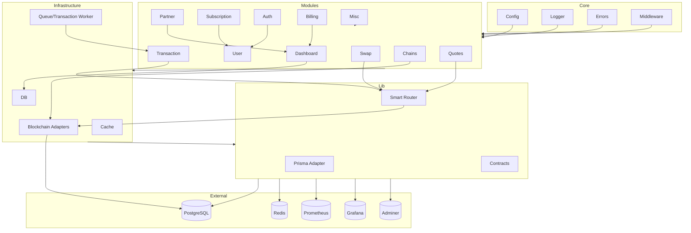

# EMPX Swap API


Production-grade TypeScript + Express API for chain discovery, quote estimation, swap transaction building, API-key governance, usage metering, billing, and partner management. Modular, scalable, and ready for enterprise integration.

## Architecture & Data Flow Diagram



## Table of Contents

- [1) Overview](#1-overview)
- [2) Tech stack](#2-tech-stack)
- [3) Architecture & Folder Structure](#3-architecture--folder-structure)
- [4) Prerequisites](#4-prerequisites)
- [5) Setup & Development Workflow](#5-setup--development-workflow)
- [6) Environment Variables](#6-environment-variables)
- [7) API Docs & Health Endpoints](#7-api-docs--health-endpoints)
- [8) Common Commands](#8-common-commands)
- [9) Logging, Metrics, Observability](#9-logging-metrics-observability)
- [10) Database & Prisma](#10-database--prisma)
- [11) Troubleshooting](#11-troubleshooting)
- [12) Maintainer & License](#12-maintainer--license)

## 1) Overview

EMPX Swap API is a backend service powering swap workflows, partner integrations, and enterprise-grade governance. Key features:

- Auth/user flows, API key issuance, quota/rate limiting
- Chain/token metadata, quoting, swap transaction orchestration
- Partner, admin, billing, dashboard, and subscription modules
- OpenAPI docs, request validation, health endpoints
- Idempotency for swap execution, API key usage logging, structured logging, and metrics
- Modular UseCase/controller/service architecture for maintainability

## 2) Tech stack

- Node.js 20+, TypeScript, Express
- PostgreSQL + Prisma ORM
- Redis (rate limiting, caching)
- Zod schemas (validation)
- Swagger UI + OpenAPI YAML (docs)
- Winston (structured logging)
- Prometheus (metrics)
- Jest + Supertest (testing)

## 3) Architecture & Folder Structure

Modular, domain-driven structure:

- `src/core`: config, logger, errors, middleware (idempotency, API key usage)
- `src/modules`: swap, transaction, partner, subscription, auth, user, dashboard, chains, quotes, billing, misc
- `src/infrastructure`: blockchain adapters, cache, db, queue (transaction worker)
- `src/lib`: shared adapters/utilities (prisma, smart-router, contracts)
- `src/scripts`: seeding/setup helpers
- `prisma`: schema, migrations
- `openapi`: split OpenAPI modules
- `docs`: architecture, logging, analysis, behavior matrix

Reference docs:

- `docs/ENTERPRISE_ARCHITECTURE.md` (refactoring, folder structure, UseCases)
- `docs/LOGGING.md` (log fields, ingestion)
- `docs/ANALYSIS_REPORT_22_Feb.md` (file classification, environment, endpoints)
- `docs/BEHAVIOR_MATRIX.md` (error codes, invariants)

## 4) Prerequisites

- Node.js 20+ (LTS recommended)
- npm 9+
- Docker Desktop (PostgreSQL, Redis, Adminer, Prometheus, Grafana)
- VS Code (TypeScript, Prisma extensions)
- Postman/Swagger UI for endpoint testing

## 5) Setup & Development Workflow

### Initial Setup

1. Clone repo: `git clone https://github.com/3mperorsSeal/empx-swap-API && cd empx-swap-API`
2. Create `.env` from `.env.example` (see template for required keys)
3. Start infrastructure: `docker compose up postgres redis adminer prometheus grafana -d`
4. Install dependencies: `npm install`
5. Apply migrations: `npm run migrate:dev`
6. Seed data: `npm run seed`
7. Start API: `npm run start:dev` (default: `http://localhost:3000`)

### Daily Workflow

1. Pull latest changes
2. Re-run migrations if schema changed: `npm run migrate:dev`
3. Re-seed if seed data changed: `npm run seed`
4. Start service: `npm run start:dev`
5. Run tests: `npm test`
6. Typecheck: `npm run typecheck`

## 6) Daily development workflow

1. Pull latest changes from default branch.
2. Re-run migrations if schema changed: `npm run migrate:dev`.
3. Re-seed when seed data changes: `npm run seed`.
4. Start service: `npm run start:dev`.
5. Run tests before opening PR: `npm test`.
6. Validate TypeScript before merge: `npm run typecheck`.

## 6) Environment Variables

See `.env.example` for all keys. Key variables:

- `NODE_ENV`, `PORT`, `DATABASE_URL`, `REDIS_URL`, `FRONTEND_ORIGINS`, `LOG_LEVEL`, `LOG_DIR`, `SERVICE_NAME`
- `JWT_SECRET`, `ADMIN_EMAIL`, `ADMIN_PASSWORD`, `TEST_KEY`, `DASHBOARD_SECRET`, `BCRYPT_ROUNDS`, `LOG_VERBOSE`, `LOG_MAX_FILES`, `LOG_CONSOLE`
- RPC URLs: `PULSECHAIN_RPC_URL`, `ETHEREUM_RPC_URL`, `POLYGON_RPC_URL`, etc.
- `METRICS_TOKEN` (optional, for securing `/metrics`)

Security:

- Never commit `.env`
- Rotate secrets in non-dev environments
- Use a secrets manager for production/staging

## 7) API Docs & Health Endpoints

- Swagger UI: `/docs`
- OpenAPI JSON: `/openapi.json`
- OpenAPI YAML: `/openapi.yaml`
- Health: `/status` (legacy), `/health/liveness`, `/health/readiness`
- Metrics: `/metrics` (Prometheus)

Protected routes require `X-API-KEY` header.

## 8) Common Commands

```bash
# Development
npm run start:dev

# Build & Production
npm run build
npm run start:prod

# Tests
npm test

# Typecheck
npm run typecheck

# Prisma
npm run prisma:generate
npm run migrate:dev
npm run migrate
npm run prisma:studio

# Seed
npm run seed
```

## 9) Logging, Metrics, Observability

- Winston structured logs (JSON lines, request/response/error fields)
- Log directory: `LOG_DIR` (default: `logs`)
- Prometheus metrics: `/metrics`
- Request correlation: request IDs, middleware logging
- API key usage logging: partner usage logs, quota/rate tracking

See `docs/LOGGING.md` for log field standards and examples.

## 10) Database & Prisma

- Prisma schema: `prisma/schema.prisma`
- Generated client: `generated/prisma`
- Migrations: `prisma/migrations`

Local reset (dev only):

1. Stop API
2. Reset DB container volume if needed
3. Run `npm run migrate:dev` and `npm run seed`

Production:

- Use `npm run migrate` in CI/CD
- Never run destructive resets in production

## 11) Troubleshooting

- **Startup fails (`Invalid environment variables`)**: Check `.env`, `DATABASE_URL`, required keys
- **Port in use**: Change `PORT` or stop conflicting process
- **DB connection errors**: Ensure Docker services running (`docker compose ps`), check `localhost:5432`
- **Missing Prisma client/types**: Run `npm run prisma:generate`
- **Protected endpoint errors**: Use valid `X-API-KEY`, check quota/rate status

## 12) Maintainer & License

Maintainer:

- Muhammad Talal Jami — Senior Software Engineer
- Email: `itxtalal@gmail.com`
- Website: `https://mtalaljamil.me/`

License:

- Proprietary (EmpSeal)
- Copyright (c) 2026 EmpSeal. All rights reserved.
- Internal/private repository; not distributed as open source.
